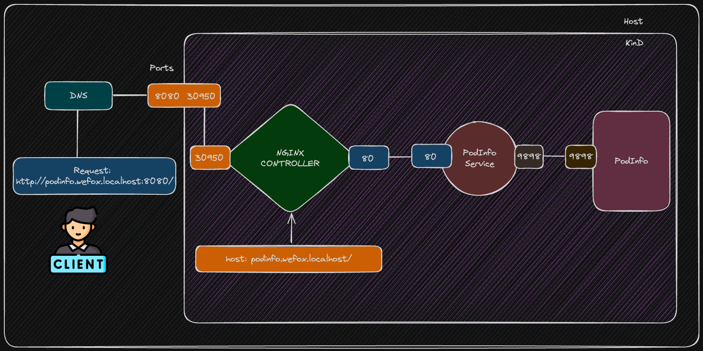

# WeFox
> Disclaimer: For the sake of simplicity, we will address the utilization of this entire toolset from the repository's README. Please note that the prerequisites for its functionality are outlined in various repositories as per best practices.

## Topology



## Terraform Infrastructure
### Description
#### This is a Kubernetes cluster bootstrapped using Terraform with ArgoCD and an NGINX Ingress, intended for deploying a test workload.

### Requirements
- Docker
- Terraform CLI
- kubectl

### Addons
The cluster will be bootstraped with the following addons after provisioned:
- ArgoCD, for GitOps.
- NGINX Ingress, to expose workloads through HTTP protocol.

### Instructions to deploy.
1. Set de dependencies.
    1. Set the kind *kube config* as env var, to operate it after provisioned.
    ```bash
    export KUBECONFIG=~/.kube/config-kind
    ```
3. Deploy the WeFox pre-prod cluster and boostrap it with Terraform.
    1. Prepare your working directory
    ```bash
    terraform init
    ```
    2. Make your plan, and check the providers
    ```bash
    terraform plan -out=tf.plan
    ```
    3. Deploy the infrastructure and bootstrap
    ```bash
    terraform apply tf.plan
    ```
4. Check for connectivity.
```bash
kubectl get nodes
```
> If connectivity fails, please esure that the correct kubeconfig is configured. (Step 1)

## ArgoCD Apps
### Description
#### For application deployment, we'll be utilizing ArgoCD. You can find the ArgoCD apps here [ArgoCD App](https://github.com/rGarmendia/argocd-apps/tree/main).

You can access to the manifest file under [this path](https://github.com/rGarmendia/argocd-apps/tree/main/podinfo). Both downloading the file, or cloning the repository to get the manifest file will work.

Then let's create the Argo App.

### ArgoCD Apps Deployment
1. Create the ArgoCD app.
```bash
kubectl apply --filename [WORKING DIR]/argocd-apps/podinfo/ --namespace argocd
```
2. Get the ArgoCD initial admin pass, to access the ArgoCD Server UI. You can change this later.
    1. Get the manifest
    ```bash
    kubectl get secret --namespace argocd -o yaml argocd-initial-admin-secret
    ```
    2. Copy the value of **password**
    3. Decrypt the password.
    ```bash
    echo "[COPIED VALUE]" | base64 -d
    ```
3. Access the ArgoCD Server.
    1. Port-forward the ArgoCD server service:
        ```bash
        kubectl port-forward svc/argocd-server 8090:443 -n argocd
        ```
        You can access the ArgoCD server, here [ArgoCD Server](http://localhost:8090)
    2. Credencials:
        1. user: admin
        2. password: the value you found in 2.3
4. Sync the App through the UI.

## Accessing the Workload
### Description
#### An application named *podinfo* has been deployed in the cluster and is being managed by ArgoCD. The application is treated as a Helm chart for simplicity. You can find the chart here [podinfo dummy chart](https://github.com/rGarmendia/dummy-app).

1. Create a way to communicate between the host and the app.
    1. Create a registry in */etc/hosts/* with *podinfo.wefox.localhost* pointing to *127.0.0.1*
    2. The app, should be accessible through http://podinfo.wefox.localhost:8080/.

The version must be **6.5.1**.

2. To update the version of **podinfo**, go to [podinfo dummy chart](https://github.com/rGarmendia/dummy-app), and change the version on this [line](https://github.com/rGarmendia/dummy-app/blob/8b3d4076ce26e4a359d71e303e94416e6c594f3a/podinfo/podinfo-values.yaml#L6).

Change the Docker image tag from 6.5.1 to 6.5.3, commit and push your changes. Go into the ArgoCD, and sync the app.

In a typical workflow, an application undergoes testing, compilation, and containerization, or solely containerization. The resulting image is then tagged and pushed to a registry, with the new tag assigned in the values file. Consequently, ArgoCD detects these changes and synchronizes with the Kubernetes cluster.

Check it, here http://podinfo.wefox.localhost:8080/.

**Please, remember that the change may take time.**

## Cluster Enhancement plan.
You can find more information about enhancement plan here [Enhancement Plan](./docs/cluster-improvements.md).
